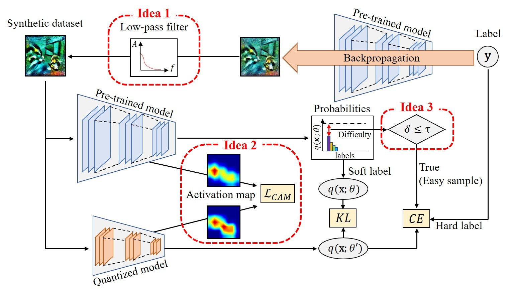

# Accurate Zero-shot Quantization by Synthesis-aware Fine-tuning

This project is a PyTorch implementation of **"Accurate Zero-shot Quantization by Synthesis-aware Fine-tuning"**.
The paper proposes SynQ, an accurate Zero-shot Quantization (ZSQ) method.




## Prerequisites

Our implementation is based on PyTorch, TorchVision, and PyTorchCV libraries.

- Python 3.9.12
- PyTorch 2.1.0
- PyTorchCV 0.0.67

We include `requirements.txt`, which contains all the packages used for the experiment. 
We also contain a working code for PyTorchCV library within `src/pytorchcv` to mitigate the dependency issue.
We checked the dependency using a workstation with Intel Xeon Silver 4214 and RTX 3090, where its CUDA version was 11.6.
Install the required packages with the following code:

```shell
pip install -r requirements.txt
```

### Usage
For usage, first generate the synthetic dataset with the code under `src/data_generate/`.
We include `run_generate_imagenet.sh`, which generates the synthetic dataset using a ResNet-18 model pre-trained on the ImageNet dataset.

```shell
cd src/data_generate
bash run_generate_imagenet.sh
```

Second, fine-tune the quantized model by executing `src/main_direct.py`.
We include `run_imagenet.sh`, for the 3bit Zero-shot Quantization (ZSQ) for ResNet-18 model pre-trained on the ImageNet dataset.

To run with different settings, modify the config files under `src/config/` or the arguments passed into `src/data_generate/generate_data.py` and `src/main_direct.py`.

### Code Description

This repository is written based on the codes from **ZeroQ** (CVPR '20) \[[Github](https://github.com/amirgholami/ZeroQ)\], **IntraQ** (CVPR '22) \[[Github](https://github.com/zysxmu/IntraQ)\], **HAST** (CVPR '23) \[[Github](https://github.com/lihuantong/HAST)\], and a PyTorch implementation of Grad-CAM and Grad-CAM++ \[[Github](https://github.com/1Konny/gradcam_plus_plus-pytorch)\].
Here is an overview of our codes.

``` Unicode
SynQ/
├── images/
│   └── synq.jpg                     # the overall architecture
├── src/
│   ├── config/                      # configurations for fine-tuning      
│   ├── data_generate/               # synthetic dataset generation
│   ├── pytorchcv/                   # pytorchcv library
│   ├── quantization_utils/          # utils for quantization
│   ├── utils/                       # frequently used code snippets
│   ├── conditional_batchnorm.py     # conditional batch normalization layer
│   ├── dataloader.py                # dataloader for test data
│   ├── gradcam.py                   # gradcam and gradcam++ code
│   ├── main_direct.py               # fine-tuning code
│   ├── options.py                   # storing code for configurations
│   └── trainer_direct.py            # trainer code
├── .gitignore                       # gitignore file
├── LICENSE                          # license for the use of the code
├── README.md                        # readme file
└── requirements.txt                 # required packages
```
